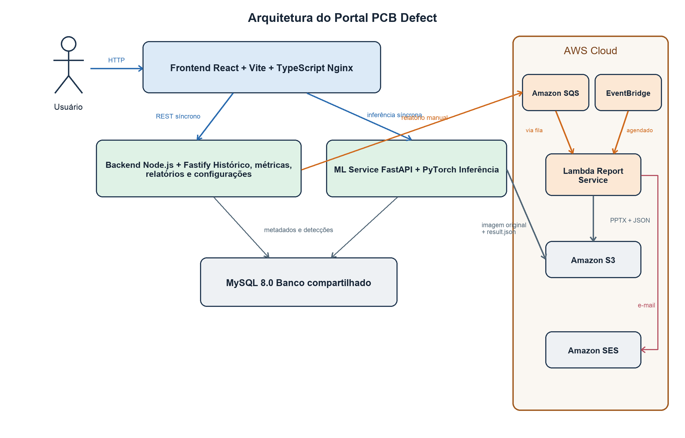
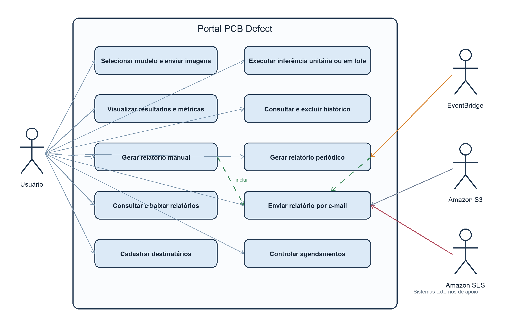
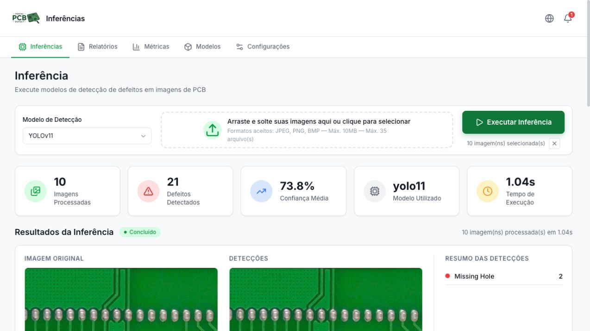
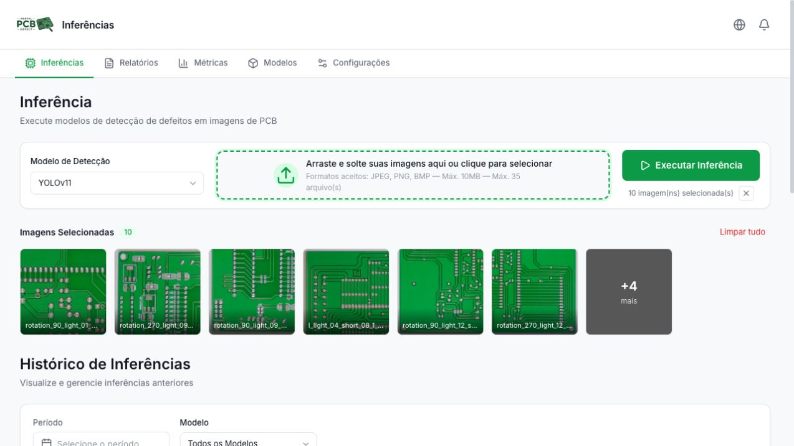
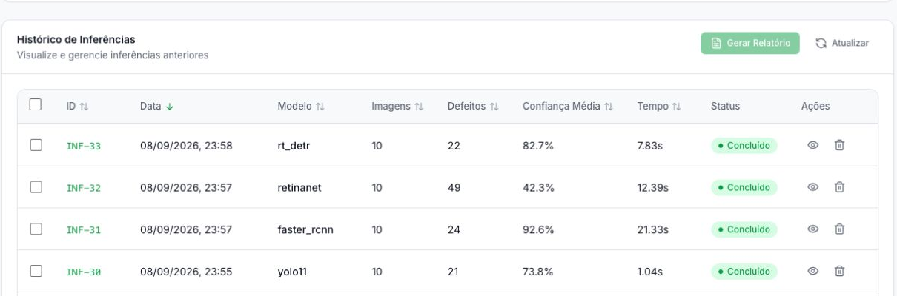
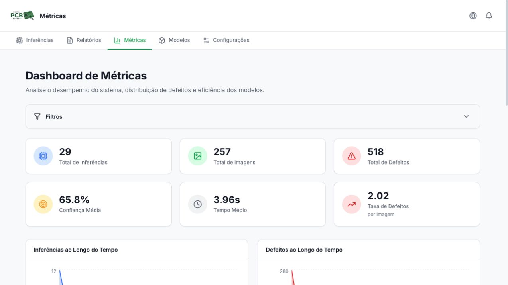
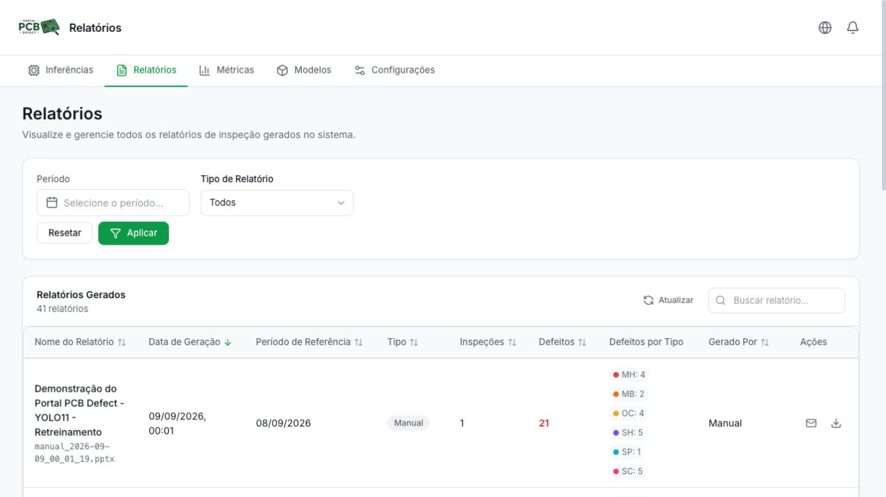
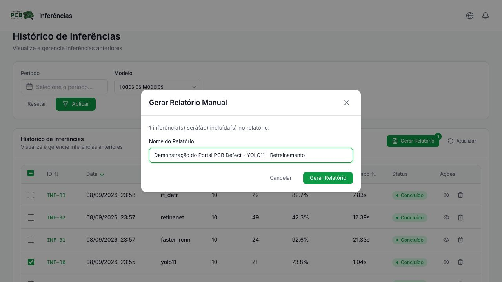
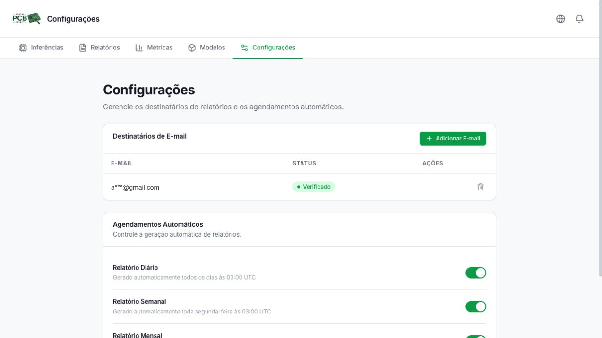

# Portal PCB Defect

**Avaliação comparativa de redes neurais para detecção e monitoramento de defeitos em placas de circuito impresso.**

> 🎓 Projeto desenvolvido como **Trabalho de Conclusão de Curso (PI: PROJETO FINAL I e II) em Engenharia de Computação**, na Escola Politécnica da **Pontifícia Universidade Católica de Campinas (PUC-Campinas)**, com finalidade acadêmica, educacional e de pesquisa.
>
> **Autor:** Alexandre A. Tescaro Oliveira
>

O trabalho reúne o treinamento e a comparação de quatro detectores de objetos e o desenvolvimento de um portal web para aplicar esses modelos a imagens de PCBs (*Printed Circuit Boards*). O sistema permite executar inspeções, consultar resultados e acompanhar indicadores em uma interface integrada.

O Portal é um **protótipo experimental**, avaliado em ambiente local no contexto do TCC. Os resultados se referem ao conjunto de dados e ao protocolo adotados; não representam validação em uma linha de produção industrial.

## O que o projeto oferece

- Inferência individual ou em lote com **YOLO11, Faster R-CNN, RetinaNet e RT-DETR**.
- Comparação visual entre a imagem original e as regiões detectadas, com classe e confiança.
- Histórico de inferências, filtros e dashboard de métricas operacionais.
- Relatórios em **PowerPoint (PPTX)**, gerados manualmente ou por agendamento, com download e envio por e-mail.
- Configuração de destinatários e agendamentos diários, semanais e mensais.

Os experimentos utilizaram um subconjunto adaptado de **5.000 imagens**, com seis classes de defeitos: furo ausente (*missing hole*), irregularidade na borda (*mouse bite*), circuito aberto (*open circuit*), curto-circuito (*short*), projeção de cobre (*spur*) e cobre espúrio (*spurious copper*).

Os notebooks e os registros experimentais estão em [`neural-links-pcb-defect-detection/`](./neural-links-pcb-defect-detection/). As métricas do portal resumem as inspeções executadas; a avaliação dos modelos com anotações de referência é realizada nos experimentos do TCC.

## Arquitetura

O frontend acessa a API de consultas e configurações e envia as imagens ao serviço de inferência. Backend e ML Service compartilham o MySQL; as imagens originais e os resultados JSON são armazenados no S3. As marcações são desenhadas sobre as imagens pela interface.

Os relatórios são processados de forma assíncrona: solicitações manuais passam pelo SQS, enquanto os agendamentos do EventBridge acionam diretamente a Lambda. O Report Service gera os arquivos no S3 e envia notificações pelo SES.



*Diagrama de arquitetura utilizado no TCC (Figura 2).*

| Componente | Tecnologias e responsabilidade |
| --- | --- |
| `frontend/` | React, Vite e TypeScript; interface web e Nginx no Docker |
| `backend/` | Node.js, Fastify e Sequelize; histórico, métricas e configurações |
| `ml-service/` | Python, FastAPI, PyTorch e Ultralytics; carregamento dos modelos e inferência |
| `report-service/` | Node.js e pptxgenjs em AWS Lambda; geração de relatórios |
| Banco de dados | MySQL 8.0; inferências, imagens, detecções e configurações |
| `terraform/` | Infraestrutura AWS: S3, SQS, Lambda, EventBridge, SES e IAM |

## Casos de uso



*Diagrama de casos de uso utilizado no TCC (Figura 1).*

## Principais telas

As capturas abaixo são as mesmas utilizadas na demonstração documentada no TCC. Os valores exibidos correspondem àquela execução experimental.

### Inferência e visualização dos resultados

Seleção do modelo, envio de imagens e comparação entre a imagem original e as detecções.



<details>
<summary>Ver envio em lote e histórico dos quatro modelos</summary>





</details>

### Dashboard de métricas

Indicadores agregados de inferências, imagens, defeitos, confiança e tempo de execução.



### Relatórios

Consulta, download e envio dos relatórios gerados.



<details>
<summary>Ver solicitação de relatório manual</summary>



</details>

### Configurações

Gerenciamento dos destinatários de e-mail e dos agendamentos automáticos.



## Preparação do ambiente

### Pré-requisitos

- **Git e Git LFS**, para baixar o código e os pesos dos modelos.
- **Docker com Compose v2**, para executar os serviços ou somente o banco no desenvolvimento.
- Para desenvolvimento local: **Node.js 24**, npm e **Python 3.11** com suporte a ambientes virtuais.
- Acesso aos recursos **AWS** usados pelo projeto para testar os fluxos completos.

Os comandos abaixo consideram um terminal Bash/Zsh (Linux ou macOS). No Windows, pode-se usar WSL2.

### 1. Clonar e baixar os modelos

```bash
git lfs install
git clone https://github.com/alehholiveira/pcb-defect-detection.git
cd pcb-defect-detection
git lfs pull
```

Os pesos devem estar em `ml-service/app/models/` como arquivos completos, e não apenas ponteiros do Git LFS:

```text
yolo11.pt
rt_detr.pt
fasterrcnn_resnet50_fpn_v2.pth
retinanet_resnet50_fpn.pth
```

Não é necessário treinar os modelos novamente para usar o portal. O serviço admite execução em CPU; o Compose atual não configura acesso à GPU. O primeiro carregamento também pode baixar pesos auxiliares de backbone.

### 2. Entender as dependências externas

O Compose inicia **frontend, backend, ML Service e MySQL**. Ele não provisiona nem emula a AWS, e o Report Service executa como Lambda.

- **Inferência completa:** exige um bucket S3 acessível e credenciais com permissão de gravação. O fluxo atual depende do upload para concluir a persistência; sem S3, a requisição de inferência falha.
- **Relatórios e e-mails:** exigem S3, SQS, Lambda, EventBridge e SES configurados.
- **Interface e APIs:** podem ser iniciadas para desenvolvimento sem completar essas integrações, mas as funcionalidades que acessam a AWS ficam indisponíveis.

Nos arquivos de ambiente do backend e do ML Service, configure a mesma região e o mesmo bucket. O nome da variável difere entre os serviços:

| Configuração | Backend | ML Service |
| --- | --- | --- |
| Região | `AWS_REGION` | `AWS_REGION` |
| Bucket | `S3_BUCKET_NAME` | `AWS_S3_BUCKET_NAME` |
| Credenciais | `AWS_ACCESS_KEY_ID`, `AWS_SECRET_ACCESS_KEY` | `AWS_ACCESS_KEY_ID`, `AWS_SECRET_ACCESS_KEY` |

Adicione `AWS_SESSION_TOKEN` se usar credenciais temporárias. No backend, preencha também `SQS_QUEUE_URL`, `SENDER_EMAIL` e as três variáveis `EVENTBRIDGE_*_RULE_NAME` para os relatórios. Use um remetente verificado no SES e destinatários verificados quando exigido pela conta. Mantenha credenciais somente nos arquivos de ambiente locais, fora do versionamento.

A infraestrutura está definida em [`terraform/`](./terraform/). Para provisioná-la, é necessário Terraform >= 1.5, credenciais AWS, os pacotes da Lambda e a configuração de `sender_email`. Consulte [`terraform/variables.tf`](./terraform/variables.tf), [`terraform/outputs.tf`](./terraform/outputs.tf) e os scripts de build em [`report-service/package.json`](./report-service/package.json).

## Executar com Docker

### 1. Preparar as variáveis

Na raiz do repositório, copie os exemplos **se os arquivos de destino ainda não existirem**:

```bash
cp backend/.env.production.example backend/.env.production
cp ml-service/.env.production.example ml-service/.env.production
```

Edite os dois arquivos com as configurações AWS descritas acima. Mantenha `DB_HOST=db` e as credenciais do banco iguais às do Compose. No backend, use `CORS_ORIGIN=http://localhost`.

Por padrão, o banco utiliza `pcb_defect_db`, usuário `pcb_user` e senha `pcb_password`. Se alterar esses valores, configure também `DB_NAME`, `DB_USER` e `DB_PASSWORD` em um `.env` na raiz, lido pelo Compose; a senha de root é definida por `DB_ROOT_PASSWORD`. Os arquivos de ambiente dos serviços não alteram automaticamente a configuração do container MySQL.

### 2. Construir e iniciar

```bash
docker compose up --build -d
docker compose ps
docker compose logs -f backend ml-service
```

Aguarde o banco ficar saudável e os modelos terminarem de carregar. O backend cria as tabelas automaticamente na inicialização. Use `Ctrl+C` para sair da visualização dos logs.

Acesse o portal em **[http://localhost](http://localhost)**.

### 3. Verificar e encerrar

```bash
curl http://localhost:3000/health/
curl http://localhost:8000/ml-service/health
```

Na resposta do ML Service, confira se `models_loaded` contém `yolo11`, `rt_detr`, `faster_rcnn` e `retinanet`. O serviço pode responder mesmo sem todos os pesos carregados.

Para encerrar os containers preservando os dados do MySQL:

```bash
docker compose down
```

## Executar localmente para desenvolvimento

Neste modo, somente o MySQL roda em Docker; as aplicações usam recarregamento automático. Cada terminal abaixo deve começar na **raiz do repositório**.

### 1. Configurar os serviços e iniciar o banco

Copie os exemplos apenas se os respectivos arquivos ainda não existirem:

```bash
cp backend/.env.example backend/.env
cp ml-service/.env.example ml-service/.env
cp frontend/.env.example frontend/.env

# O Compose também referencia esses arquivos ao carregar a configuração.
cp backend/.env.production.example backend/.env.production
cp ml-service/.env.production.example ml-service/.env.production

docker compose up -d db
docker compose ps db
```

Se estava usando a execução completa em Docker, rode `docker compose down` antes de mudar de modo para liberar as portas. Aguarde o MySQL ficar saudável.

No backend e no ML Service locais, mantenha `DB_HOST=127.0.0.1`, porta `3306` e as mesmas credenciais do banco. Preencha as variáveis AWS nos respectivos `.env` para testar os fluxos completos. No `frontend/.env`, mantenha os destinos do proxy em `http://localhost:3000` e `http://localhost:8000`.

### 2. Backend — terminal 1

```bash
cd backend
npm ci
npm run dev
```

Aguarde a conexão e a criação automática das tabelas antes de iniciar o ML Service. API em **[http://localhost:3000](http://localhost:3000)** e documentação em **[http://localhost:3000/docs](http://localhost:3000/docs)**.

### 3. ML Service — terminal 2

```bash
cd ml-service
python3.11 -m venv .venv
source .venv/bin/activate
python -m pip install -r requirements.txt
python -m uvicorn app.main:app --env-file .env --reload --host 0.0.0.0 --port 8000
```

O parâmetro `--env-file .env` também disponibiliza as credenciais AWS ao cliente S3. Documentação em **[http://localhost:8000/docs](http://localhost:8000/docs)**. Aguarde o carregamento dos modelos; alterações no serviço provocam um novo carregamento.

### 4. Frontend — terminal 3

```bash
cd frontend
npm ci
npm run dev
```

Acesse **[http://localhost:5173](http://localhost:5173)**. O Vite encaminha as chamadas às duas APIs pelos proxies configurados no `.env`.

### 5. Conferir o fluxo

Com S3 e credenciais configurados, abra **Inferências**, selecione um modelo e envie uma imagem de PCB. Confira as marcações e o registro no histórico. Com a infraestrutura de relatórios disponível, selecione a inferência no histórico, gere um relatório e consulte a página **Relatórios**.

Para encerrar, use `Ctrl+C` nos três terminais e `docker compose stop db` na raiz do repositório.

## Testes e documentação técnica

Na raiz do repositório:

```bash
npm --prefix backend test
npm --prefix frontend test
npm --prefix report-service ci
npm --prefix report-service test
```

Para o ML Service, com o ambiente virtual ativado:

```bash
cd ml-service
python -m pip install -r requirements-dev.txt
python -m pytest
```

Os testes que usam Testcontainers precisam do Docker em execução. A arquitetura técnica está detalhada em [`docs/ARCHITECTURE.md`](./docs/ARCHITECTURE.md).

## Referência acadêmica

O repositório documenta uma implementação acadêmica. Ao reutilizar código, modelos ou dados, preserve a atribuição ao trabalho e observe os termos aplicáveis a cada dependência e conjunto de dados.
