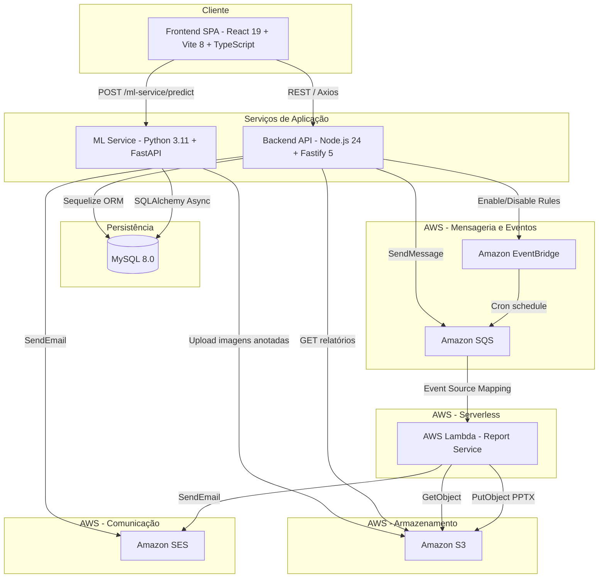
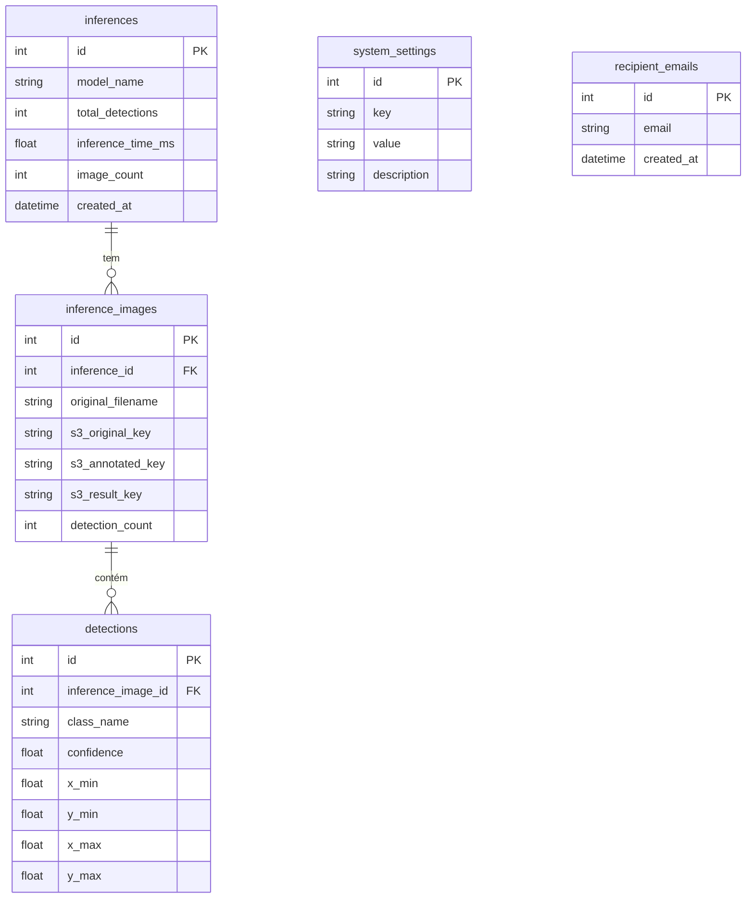
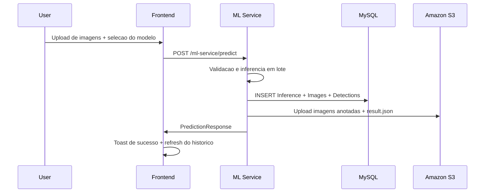
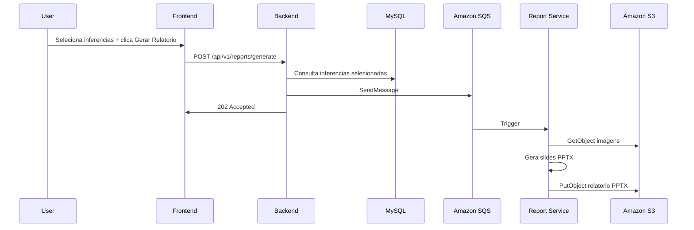
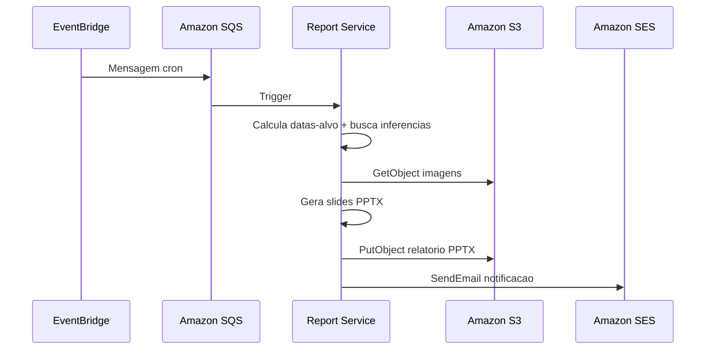
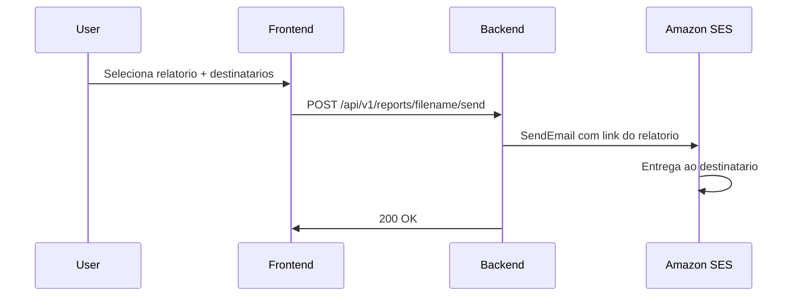

# Arquitetura do Sistema

Documentação técnica da arquitetura do sistema de detecção de defeitos em PCBs.

---

## 1. Visão Geral

O sistema adota uma **arquitetura de microsserviços** com 4 serviços principais e serviços gerenciados AWS, organizados para separação de responsabilidades e escalabilidade independente.

### Princípios Arquiteturais

- **Separação de responsabilidades**: Cada serviço tem uma responsabilidade única e bem definida.
- **Independência tecnológica**: O ML Service utiliza Python/PyTorch enquanto o Backend usa Node.js/TypeScript — cada um com a stack mais adequada.
- **Comunicação mista**: REST síncrono para interações em tempo real, mensageria assíncrona (SQS) para processamento de relatórios, event-driven (EventBridge) para agendamentos.
- **Banco compartilhado**: MySQL como fonte única de verdade entre Backend e ML Service.

---

## 2. Diagrama de Arquitetura

---

## 3. Componentes do Sistema

### 3.1 Frontend (React + Vite + TypeScript)

| Aspecto | Detalhe |
|---------|---------|
| **Framework** | React 19 com Vite 8 e TypeScript 6 |
| **Porta** | 5173 (desenvolvimento) / 80 (produção via Nginx) |
| **Roteamento** | react-router-dom v7 |
| **i18n** | i18next + react-i18next (pt-BR e en) |
| **Charts** | Recharts (AreaChart, PieChart, BarChart, ComposedChart) |
| **Ícones** | Lucide React |
| **HTTP Client** | Axios com service layer + validação Zod |
| **CSS** | BEM (Block Element Modifier) com variáveis CSS |
| **State** | Custom React Hooks (useInference, useMetrics, useSettings, etc.) |

**Páginas principais:**

| Página | Descrição |
|--------|-----------|
| **Inferências** | Upload de imagens, execução de inferência, histórico com filtros |
| **Métricas** | Dashboard com gráficos de séries temporais, distribuição de defeitos, uso de modelos |
| **Modelos** | Comparativo das 4 arquiteturas treinadas com métricas e exemplos |
| **Relatórios** | Listagem, geração manual, envio por e-mail |
| **Configurações** | Gerenciamento de e-mails destinatários e agendamentos automáticos |

---

### 3.2 Backend (Node.js + Fastify + TypeScript)

| Aspecto | Detalhe |
|---------|---------|
| **Runtime** | Node.js 24 |
| **Framework** | Fastify 5 com TypeScript 5.8 |
| **ORM** | Sequelize (MySQL) |
| **Validação** | Zod (schemas para request/response) |
| **Documentação** | Swagger (@fastify/swagger + @fastify/swagger-ui) |
| **Porta** | 3000 |

**Endpoints da API:**

| Grupo | Método | Rota | Descrição |
|-------|--------|------|-----------|
| **Health** | GET | `/health/` | Status da API + banco, uptime, latência |
| **Inferências** | GET | `/api/v1/inferences` | Listar com filtros (data, modelo, defeito, paginação) |
| | GET | `/api/v1/inferences/:id` | Detalhes com imagens e detecções |
| | DELETE | `/api/v1/inferences/:id` | Remover inferência e registros associados |
| **Relatórios** | GET | `/api/v1/reports` | Listar com filtros (tipo, data, paginação) |
| | POST | `/api/v1/reports/generate` | Gerar relatório manual via SQS |
| | POST | `/api/v1/reports/:filename/send` | Enviar relatório por e-mail via SES |
| **Métricas** | GET | `/api/v1/metrics` | Dashboard (séries temporais, distribuição, confiança) |
| **Configurações** | GET | `/api/v1/settings/emails` | Listar destinatários com status de verificação SES |
| | POST | `/api/v1/settings/emails` | Adicionar destinatário + verificar no SES |
| | DELETE | `/api/v1/settings/emails/:id` | Remover destinatário + deletar identidade SES |
| | GET | `/api/v1/settings/schedules` | Status das regras EventBridge |
| | PUT | `/api/v1/settings/schedules` | Habilitar/desabilitar regras (diário, semanal, mensal) |

**Integrações AWS:**

- **S3**: Leitura de relatórios para listagem no frontend
- **SQS**: Envio de mensagens para geração de relatórios
- **SES**: Envio de e-mails com links de relatórios
- **EventBridge**: Habilitação/desabilitação de regras de agendamento

---

### 3.3 ML Service (Python + FastAPI + PyTorch)

| Aspecto | Detalhe |
|---------|---------|
| **Runtime** | Python 3.11 |
| **Framework** | FastAPI com Uvicorn |
| **ML Frameworks** | PyTorch 2.5 + Ultralytics 8.3 |
| **ORM** | SQLAlchemy (async) com aiomysql |
| **Porta** | 8000 |

**Endpoint principal:**

| Método | Rota | Descrição |
|--------|------|-----------|
| POST | `/ml-service/predict` | Executa inferência em lote |
| GET | `/ml-service/health` | Status do serviço e modelos carregados |

**Fluxo de inferência:**

1. Recebe imagens via multipart upload (máx. 35 imagens, 350 MB total)
2. Valida formato (JPEG, PNG, BMP) e limites
3. Executa inferência em lote com o modelo selecionado
4. Persiste resultados no MySQL (Inference → InferenceImage → Detection)
5. Faz upload das imagens anotadas + `result.json` para o S3
6. Retorna `PredictionResponse` com detecções e métricas

**Modelos carregados na inicialização:**

- YOLOv11 (Ultralytics)
- Faster R-CNN (torchvision)
- RetinaNet (torchvision)
- RT-DETR (Ultralytics)

---

### 3.4 Report Service (AWS Lambda)

| Aspecto | Detalhe |
|---------|---------|
| **Runtime** | Node.js 24.x (AWS Lambda) |
| **Trigger** | Amazon SQS |
| **Formato** | PPTX (PowerPoint) com pptxgenjs |
| **Memória** | 512 MB |
| **Timeout** | 60 segundos |

**Tipos de trigger:**

| Origem | Fonte | Dados |
|--------|-------|-------|
| **Manual** | Backend → SQS | IDs de inferências selecionadas, nome do relatório |
| **Automático** | EventBridge → SQS | Tipo (daily/weekly/monthly), cálculo automático de datas |

**Saída:**

- PPTX com slides de capa, slides por inferência (imagens anotadas + detecções), resumo estatístico
- Upload do PPTX para S3
- Notificação por e-mail via SES (para relatórios automáticos)

---

### 3.5 Banco de Dados (MySQL 8.0)

Banco compartilhado entre Backend (Sequelize) e ML Service (SQLAlchemy).

> **Nota**: Todos os timestamps são armazenados em **UTC**. A conversão para o timezone local (`America/Sao_Paulo`) é feita na camada de aplicação/apresentação.

---

### 3.6 Infraestrutura AWS

| Serviço | Recurso | Configuração |
|---------|---------|-------------|
| **S3** | Bucket de armazenamento | Acesso público de leitura, lifecycle de 30 dias, CORS habilitado |
| **SQS** | Fila principal + DLQ | 256 KB max message, 24h retenção, long polling (20s), redrive após 3 falhas |
| **EventBridge** | 3 regras cron | Diário (03:00 UTC), Semanal (seg 03:00 UTC), Mensal (dia 1, 03:00 UTC) |
| **Lambda** | Report Service | 512 MB memória, 60s timeout, Node.js 24.x, SQS trigger (batch=5) |
| **SES** | Envio de e-mail | Sandbox mode (apenas endereços verificados) |
| **IAM** | Role da Lambda | Least-privilege: CloudWatch Logs, S3 (Get/Put), SQS (Receive/Delete), SES (Send) |

---

## 4. Fluxos de Dados

### 4.1 Fluxo de Inferência

### 4.2 Fluxo de Relatório Manual

### 4.3 Fluxo de Relatório Automático

### 4.4 Fluxo de Envio de E-mail

---

## 5. Padrões de Comunicação

| Padrão | Uso | Tecnologia |
|--------|-----|-----------|
| **Síncrono (REST)** | Frontend ↔ Backend, Frontend ↔ ML Service | HTTP/Axios, proxy Vite (dev) / Nginx (prod) |
| **Assíncrono (Mensageria)** | Backend → Lambda (relatórios manuais) | Amazon SQS |
| **Event-driven** | Agendamentos → Lambda (relatórios automáticos) | Amazon EventBridge → SQS |

---

## 6. Estratégia de Deploy

| Aspecto | Desenvolvimento | Produção |
|---------|-----------------|----------|
| **Frontend** | Vite dev server (HMR) | Nginx servindo build estático |
| **Backend** | tsx watch (hot reload) | Container Docker |
| **ML Service** | Uvicorn --reload | Container Docker |
| **Banco** | MySQL em Docker | MySQL em Docker (volume persistente) |
| **Report Service** | — | AWS Lambda |
| **Orquestração** | Serviços rodando localmente | docker-compose |

---

## 7. Estratégia de Timezone

O sistema adota a seguinte estratégia para garantir consistência temporal:

| Camada | Estratégia |
|--------|-----------|
| **Banco de dados** | Todos os timestamps armazenados em **UTC** |
| **Backend** | `APP_TIMEZONE=America/Sao_Paulo` para lógica de negócios |
| **Backend (Métricas)** | `CONVERT_TZ(created_at, '+00:00', '-03:00')` no MySQL para agrupamento correto por dia local |
| **Frontend** | `formatDateString()` com split manual de strings `YYYY-MM-DD` (evita bug de shift UTC do JavaScript) |
| **Frontend** | `formatDateTime()` com `toLocaleDateString()` para ISO strings completas |
| **EventBridge** | Regras cron em UTC (03:00 UTC = 00:00 BRT) |

> **Nota técnica**: O offset fixo de `-03:00` é utilizado porque o Brasil atualmente não observa horário de verão (DST).

---

## 8. Segurança

| Aspecto | Implementação |
|---------|---------------|
| **CORS** | Configurado por ambiente (`localhost:5173` em dev, domínio específico em prod) |
| **Validação de entrada** | Schemas Zod em todas as rotas do Backend; Pydantic no ML Service |
| **IAM** | Políticas de menor privilégio para a Lambda |
| **Secrets** | Variáveis de ambiente (nunca commitadas no repositório) |
| **SES** | Modo sandbox — apenas endereços verificados podem enviar/receber |
| **Upload** | Limites configuráveis: 35 imagens / 350 MB por inferência |
